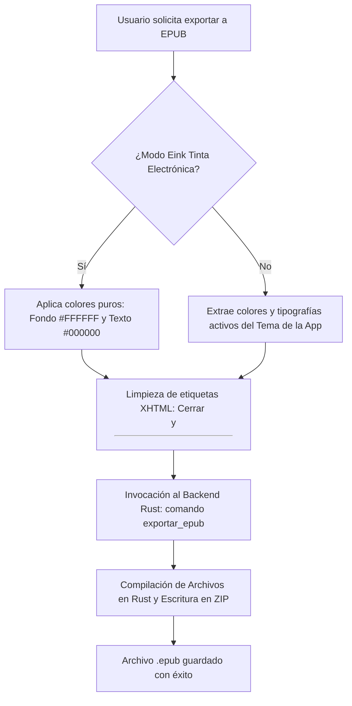

# 📖 Especificación Técnica: Exportador Premium de Libros Electrónicos EPUB
**Summa Scriptura — Documentación de Arquitectura de Exportación (v8.0)**

Este documento técnico describe de manera clara y exhaustiva el funcionamiento del motor de exportación a formato **EPUB 3.0** en *Summa Scriptura*. Su propósito es servir de guía técnica e instructivo para comprender la estructura de empaquetado del archivo final, el flujo de datos entre la interfaz gráfica (JavaScript) y el procesador de bajo nivel (Rust), y las optimizaciones de legibilidad.

---

## 🗺️ 1. Arquitectura de Archivos Interna del EPUB

Un libro electrónico en formato EPUB es, en esencia, un contenedor comprimido `.zip` estructurado de acuerdo con las especificaciones del estándar internacional IDPF/W3C. La estructura jerárquica de carpetas y archivos que *Summa Scriptura* compila y empaqueta en el disco es la siguiente:

```
[Mi_Libro.epub] (Archivo ZIP final)
├── mimetype (Archivo plano de tipo de medio sin compresión)
├── META-INF/
│   └── container.xml (Enrutador de metadatos principal)
└── OEBPS/ (Cuerpo de la Obra y Estilo)
    ├── content.opf (Manifiesto de contenido, creadores y spine de lectura)
    ├── toc.ncx (Índice jerárquico de navegación para lectores clásicos)
    ├── styles/
    │   └── style.css (Hoja de estilos CSS adaptativa o modo Eink)
    └── text/
        └── chapter1.xhtml (Manuscrito principal formateado en XHTML estricto)
```

---

## 🔄 2. Flujo de Datos de Exportación (Frontend → Backend)

El proceso de generación del libro electrónico se divide en dos fases distribuidas de forma limpia:



### Fase A: Preparación en el Frontend (JavaScript - `export-service.js`)
1. **Conversión del Manuscrito:** Traduce el texto Markdown escrito en el editor a un formato HTML interpretado utilizando el motor `marked`.
2. **Sanitización Estricta de XHTML:** Corrige las etiquetas vacías para asegurar que se cierren correctamente (por ejemplo, reemplaza `<br>` por `<br />` e `<hr>` por `<hr />`). Esto previene que el motor del lector electrónico interrumpa o corrompa el flujo visual de la lectura.
3. **Optimización Eink o Adaptativa:** 
   * **Modo Eink (Tinta Electrónica):** Si el usuario selecciona esta opción, se fuerzan parámetros de estilo ultra-agresivos: fondo blanco puro (`#FFFFFF`), texto negro puro (`#000000`), sin sombras de texto, ni degradados, ni transparencias. Esto maximiza el contraste en pantallas de tinta electrónica y evita "fantasmas" visuales.
   * **Modo Adaptativo:** Si se descarta el modo Eink, el script extrae en tiempo real las variables de color del tema que esté visualizando en la aplicación en ese instante (fondo de lectura, texto principal, enlaces) y la familia tipográfica seleccionada (`Inter`, `Atkinson`, etc.).
4. **Llamada de Puente:** Invoca el comando Tauri `exportar_epub`, enviando el manuscrito en XHTML purificado, el título, y las variables de estilo seleccionadas.

### Fase B: Procesamiento y Empaquetado en el Backend (Rust - `epub_exporter.rs`)
1. **Creación del Archivo Físico:** Abre un descriptor de archivo en el sistema operativo y crea un escritor ZIP (`ZipWriter`).
2. **Escritura del Mimetype (Regla de Oro de EPUB):** Se añade el archivo de identidad llamado `mimetype` con el texto `application/epub+zip`. Este archivo debe ser el primero de la estructura, escribirse estrictamente **sin compresión** y sin metadatos añadidos.
3. **Escritura de Metadatos XML:**
   * **`container.xml`:** Define la ruta física del manifiesto de la obra (`OEBPS/content.opf`).
   * **`content.opf` (Manifiesto de la Obra):** Declara los metadatos de autoría (*Summa Scriptura*), el idioma (`es`), un identificador único (UUID), la lista de todos los archivos del paquete y el orden secuencial de lectura (`spine`).
   * **`toc.ncx` (Tabla de Contenidos):** Genera la navegación estructurada para que los lectores antiguos o de tinta electrónica muestren los capítulos en su barra lateral. 
4. **Inyección de Hojas de Estilo y Manuscrito:** Escribe el archivo CSS adaptativo/Eink y el contenido XHTML principal en sus ubicaciones finales.
5. **Cierre de Flujo:** Finaliza la compresión del ZIP y retorna la ruta de guardado exitoso a la interfaz.

---

## 🛡️ 3. Corrección del Bug de Estructura (toc.ncx)

### El Error Detectado
Anteriormente, el archivo de navegación `toc.ncx` se generaba con una cabecera rota debido a una errata en el formato de cadena en Rust:
```rust
let toc_ncx = format!(r#"xml
<?xml version="1.0" encoding="UTF-8"?>
```
Esto provocaba que el archivo resultante en el EPUB comenzara con el texto literal `"xml"` en su primera línea. Dado que los analizadores de metadatos EPUB son extremadamente rigurosos, este texto libre invalidaba todo el archivo XML de índice, haciendo que los lectores reportaran el archivo de forma general como **"dañado"** o **"incompleto"**.

### La Enmienda Geométrica
Se eliminó la palabra `"xml"` del molde base de Rust, haciendo que el archivo inicie estrictamente de la siguiente manera:
```rust
let toc_ncx = format!(r#"<?xml version="1.0" encoding="UTF-8"?>
```
Esto restaura la validez universal de la estructura de metadatos, permitiendo que cualquier lector electrónico moderno (Kobo, Kindle, PocketBook, Calibre, etc.) valide y cargue la obra de forma inmediata.

---

## ⚡ 4. Hoja de Estilo Generada (CSS)

La hoja de estilos que se escribe dinámicamente en el EPUB (`style.css`) asegura una visualización óptima del manuscrito gracias a las siguientes reglas:

*   **Texto Justificado:** Los párrafos se alinean con `text-align: justify;` para mantener la estética tradicional de los libros físicos.
*   **Sangría de Párrafo:** Se aplica sangría de párrafo (`text-indent: 1.5em;`) en todos los párrafos de prosa subsiguientes, excepto en el primer párrafo de cada capítulo, tal como exigen las mejores prácticas de maquetación editorial.
*   **Contraste Alto (Eink):** En el modo Eink se eliminan bordes difusos o fondos de código grises que entorpezcan la lectura, asegurando una visualización nítida bajo cualquier nivel de luz de la pantalla.
